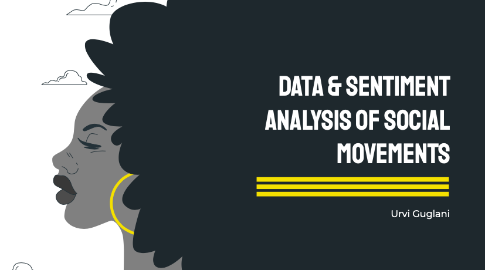

## Investigating the influence of social media on Social movements through data &amp; sentiment analysis

#### Abstract of Group Project (Exploring the biases & assumptions influencing big data in the Digital Humanities):

In today's world, big data is ubiquitous and has impact that is far-reaching on both individuals and society. Its decision has consequences that are multi-dimensional and affect mindsets both conciously and unconciously. Through our reasearch, we explore the importance of treating big data with a critical lense and ensure that we are using algorithms with healthy skepticism to prevent perpetuating prejudice in terms of race, sex etc. 

#### Abstract of Individual Project (Analyzing Social Movements through the Data Science Lense):

c